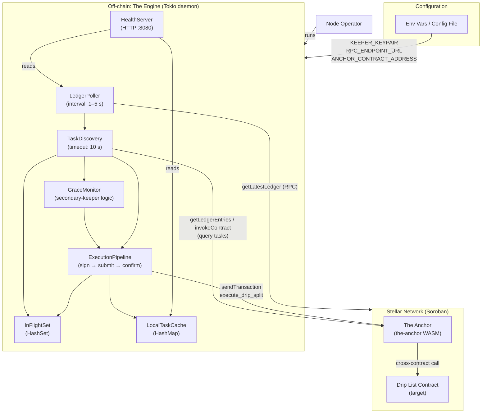
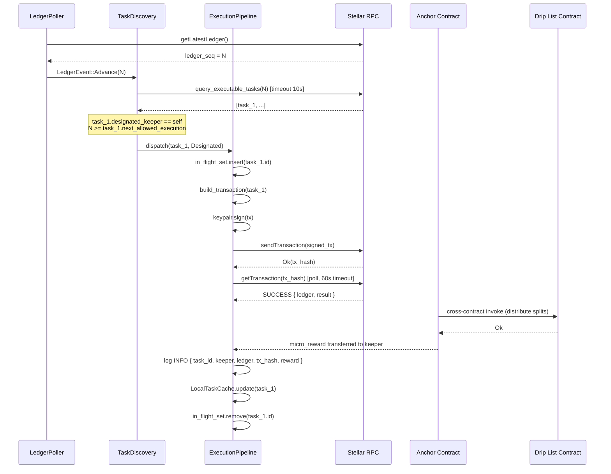
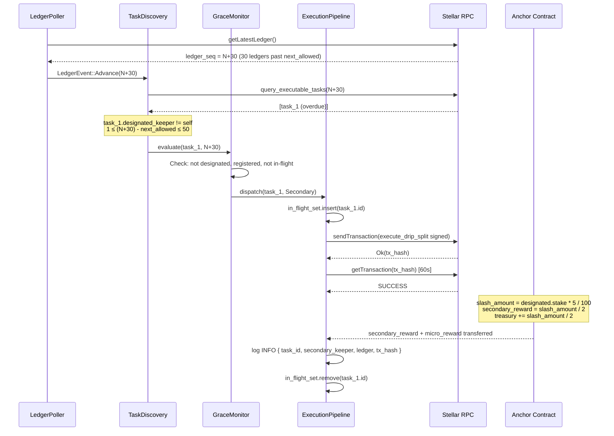
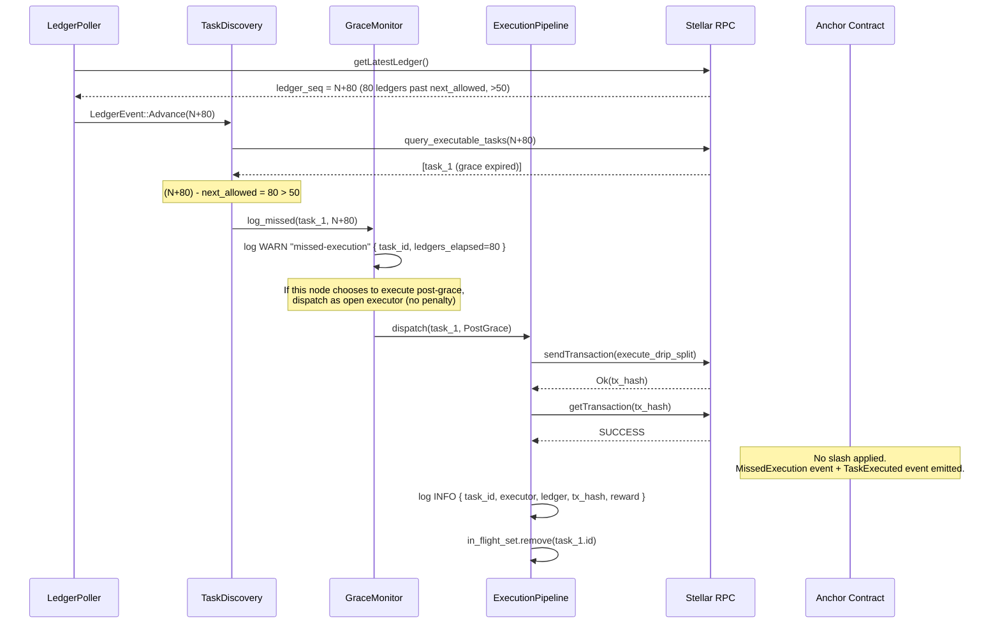

# Design Document: Chronos Keeper Network

## Overview

Chronos Keeper Network is a two-layer decentralised execution system that automates time-sensitive Drips funding-split distributions on the Stellar/Soroban blockchain without relying on centralised cron infrastructure.

**Layer 1 — The Anchor** (`the-anchor` crate): A Soroban smart contract compiled to WASM (`wasm32-unknown-unknown`, `#![no_std]`) responsible for keeper registry, staking, task provisioning, execution arbitration, slashing, and reward distribution.

**Layer 2 — The Engine** (`the-engine` crate): An off-chain Rust daemon built on Tokio that continuously polls ledger state, discovers executable tasks, constructs and signs transactions, monitors grace periods, and exposes a health-check endpoint.

**Shared types** (`chronos-types` crate): `no_std`-compatible crate containing the canonical `Keeper` and `ExecutionTask` structs shared by both layers.

### Key Design Decisions

- **Slash-first atomicity**: Slashing, secondary reward, and task update are performed in a single Soroban invocation to prevent partial state.
- **Floor division for slashing**: `slash_amount = stake * 5 / 100` (integer, rounded down) as specified.
- **Engine deduplication via HashSet**: Prevents re-entrant execution attempts while a task is in-flight.
- **Transient vs non-transient error routing**: Engine retries only network I/O errors; contract rejections drop immediately.
- **Exponential backoff capped at `max_retries`**: Bounded retry loop (1–60 s) prevents runaway retries.

---

## Architecture



### Execution Flow Summary

1. `LedgerPoller` detects ledger advance and notifies `TaskDiscovery`.
2. `TaskDiscovery` queries `the-anchor` for all tasks where `next_allowed_execution ≤ current_ledger`.
3. For each discovered task:
   - If this node is the `Designated_Keeper` → `ExecutionPipeline` takes over.
   - If `current_ledger` is within the 50-ledger grace window and this node is not the `Designated_Keeper` → `GraceMonitor` initiates secondary execution.
   - If `current_ledger` > `next_allowed_execution + 50` → `GraceMonitor` logs a missed-execution warning, no execution.
4. `ExecutionPipeline` signs, submits, and confirms (60 s timeout). On success: updates `LocalTaskCache`. On failure: classifies transient/non-transient, retries accordingly.

---

## Components and Interfaces

### `chronos-types` crate

- Defines `Keeper`, `ExecutionTask`, `TaskId`, and `KeeperAddress` types.
- Annotated with `#[contracttype]` (soroban-sdk) for on-chain compatibility.
- Uses `no_std` + `soroban_sdk` feature flags so it compiles for both WASM (contract) and native (engine).

### `the-anchor` crate

| Module | Responsibility |
|---|---|
| `lib.rs` | Contract entry point, `#[contract]` macro, top-level method dispatch |
| `registry.rs` | Keeper registration, lookup, ineligibility marking |
| `tasks.rs` | Task provisioning, unique ID generation, task lookup |
| `execution.rs` | `execute_drip_split` logic, window arbitration, cross-contract call |
| `slashing.rs` | `apply_slash`, floor-division math, treasury accounting |
| `events.rs` | All on-chain `env.events().publish(...)` calls |
| `errors.rs` | `ContractError` enum with all variants |
| `storage_keys.rs` | All `DataKey` enum variants for Soroban storage |

### `the-engine` crate

| Module | Responsibility |
|---|---|
| `main.rs` | Binary entry, config loading, runtime wiring, signal handling |
| `config.rs` | `EngineConfig` struct, env-var / file loading, validation |
| `ledger_poller.rs` | `LedgerPoller` — RPC poll loop, ledger advance detection |
| `task_discovery.rs` | `TaskDiscovery` — RPC task query with 10 s timeout |
| `execution_pipeline.rs` | `ExecutionPipeline` — sign, submit, confirm, retry logic |
| `grace_monitor.rs` | `GraceMonitor` — grace period detection, secondary-keeper dispatch |
| `in_flight.rs` | `InFlightSet` — `Arc<Mutex<HashSet<TaskId>>>` deduplication |
| `health_server.rs` | `HealthServer` — Axum/Hyper HTTP endpoint |
| `rpc_client.rs` | Thin wrapper over `rs-stellar-rpc-client` / JSON-RPC |
| `errors.rs` | `EngineError`, `TransientError`, `NonTransientError` |

---

## Data Models

### `chronos-types`

```rust
use soroban_sdk::{contracttype, Address, BytesN};

/// Unique identifier for a provisioned task (32-byte hash).
pub type TaskId = BytesN<32>;

/// Unique identifier for a keeper (Stellar account address).
pub type KeeperAddress = Address;

/// On-chain record for a registered keeper.
#[contracttype]
#[derive(Clone, Debug, PartialEq)]
pub struct Keeper {
    /// Stellar address of the keeper.
    pub address: KeeperAddress,
    /// Amount of native token staked (in stroops).
    pub stake_amount: i128,
    /// Ledger number of the most recent successful execution.
    pub last_execution_ledger: u32,
    /// Cumulative count of successful executions.
    pub total_executions: u64,
    /// Whether this keeper is ineligible for new designated-keeper assignments.
    pub ineligible: bool,
}

/// On-chain record for a provisioned execution task.
#[contracttype]
#[derive(Clone, Debug, PartialEq)]
pub struct ExecutionTask {
    /// Unique identifier for this task.
    pub task_id: TaskId,
    /// Address of the target Drip List contract.
    pub target_drip_list: Address,
    /// Number of ledgers between allowed executions.
    pub execution_interval_ledgers: u32,
    /// The earliest ledger at which this task may next be executed.
    pub next_allowed_execution: u32,
    /// Native-token reward per execution (in stroops).
    pub micro_reward_per_run: i128,
    /// Address of the keeper designated for primary execution.
    pub designated_keeper: KeeperAddress,
}
```

### `the-anchor` — Storage Keys

```rust
use soroban_sdk::contracttype;

#[contracttype]
pub enum DataKey {
    // Keeper registry entry (per keeper address)
    Keeper(Address),
    // Execution task entry (per task ID)
    Task(BytesN<32>),
    // Monotonic task counter for unique ID generation
    TaskCounter,
    // Contract admin / governance address
    Admin,
    // Minimum stake threshold (instance-level config)
    MinKeeperStake,
    // Treasury balance accumulated from slashing
    TreasuryBalance,
}
```

**Storage type assignments:**

| Key | Storage Type | Rationale |
|---|---|---|
| `DataKey::Keeper(addr)` | **Persistent** | Keeper records must survive contract upgrades and ledger expiry |
| `DataKey::Task(id)` | **Persistent** | Task records are long-lived, must not expire |
| `DataKey::TaskCounter` | **Instance** | Single counter, accessed on every `provision_task` call; fits in 64 KB instance budget |
| `DataKey::Admin` | **Instance** | Rarely changes; governance address |
| `DataKey::MinKeeperStake` | **Instance** | Config constant; governance-settable |
| `DataKey::TreasuryBalance` | **Persistent** | Accumulates over time; must not expire |

### `the-anchor` — Error Types

```rust
use soroban_sdk::contracterror;

#[contracterror]
#[derive(Copy, Clone, Debug, Eq, PartialEq)]
#[repr(u32)]
pub enum ContractError {
    // Registration
    StakeBelowMinimum           = 1,
    KeeperAlreadyRegistered     = 2,
    KeeperNotFound              = 3,

    // Task provisioning
    InvalidInterval             = 4,
    InvalidReward               = 5,
    UnauthorizedCaller          = 6,
    InvalidDripList             = 7,
    TaskNotFound                = 8,

    // Execution
    TooEarlyToExecute           = 9,
    UnauthorizedExecutor        = 10,
    DripListInvocationFailed    = 11,
    InsufficientRewardBalance   = 12,

    // Grace period
    GracePeriodActive           = 13,  // Designated keeper blocked during grace
    GracePeriodExpired          = 14,  // >50 ledgers, penalty-free open execution
    CallerNotSecondaryEligible  = 15,  // Not registered or registered after window opened

    // Slashing
    SlashOnZeroStake            = 16,

    // General
    AlreadyInitialized          = 17,
    IneligibleKeeper            = 18,
}
```

### `the-engine` — Config

```rust
use std::time::Duration;

/// Full configuration for the Engine daemon.
#[derive(Debug, Clone)]
pub struct EngineConfig {
    /// Base58-encoded Stellar keypair for this keeper node.
    pub keeper_keypair: String,
    /// URL of the Soroban RPC endpoint.
    pub rpc_endpoint_url: String,
    /// Strkey-encoded address of the deployed Anchor contract.
    pub anchor_contract_address: String,
    /// Ledger poll interval (1–5 seconds inclusive).
    pub poll_interval: Duration,
    /// Task query timeout (≤ 10 seconds).
    pub task_query_timeout: Duration,
    /// Transaction confirmation timeout (≤ 60 seconds).
    pub confirmation_timeout: Duration,
    /// Initial backoff for transient errors.
    pub retry_backoff_initial: Duration,
    /// Maximum backoff cap for transient errors (≤ 60 seconds).
    pub retry_backoff_max: Duration,
    /// Maximum retry count before giving up on a transient failure.
    pub max_retries: u32,
    /// TCP port for the health-check HTTP server (default: 8080).
    pub health_port: u16,
    /// Optional path to a TOML config file (env vars take precedence).
    pub config_file_path: Option<std::path::PathBuf>,
}
```

### `the-engine` — Health Response

```rust
use serde::Serialize;

#[derive(Serialize)]
pub struct HealthResponse {
    /// Current ledger height observed by this node.
    pub current_ledger: u32,
    /// Unix timestamp of the last successfully confirmed execution, or null if none yet.
    pub last_execution_timestamp: Option<i64>,
    /// Number of tasks currently in-flight.
    pub in_flight_count: usize,
}
```

### `the-engine` — Error Types

```rust
#[derive(Debug, thiserror::Error)]
pub enum EngineError {
    #[error("transient: {0}")]
    Transient(#[from] TransientError),
    #[error("non-transient: {0}")]
    NonTransient(#[from] NonTransientError),
}

#[derive(Debug, thiserror::Error)]
pub enum TransientError {
    #[error("I/O error: {0}")]
    Io(#[from] std::io::Error),
    #[error("connection timeout after {elapsed:?}")]
    ConnectionTimeout { elapsed: std::time::Duration },
    #[error("connection reset by peer")]
    ConnectionReset,
    #[error("RPC response timeout")]
    RpcTimeout,
}

#[derive(Debug, thiserror::Error)]
pub enum NonTransientError {
    #[error("contract rejected execution: {reason}")]
    ContractRejection { reason: String },
    #[error("confirmation timeout after {elapsed:?}")]
    ConfirmationTimeout { elapsed: std::time::Duration },
    #[error("keypair decode error: {0}")]
    KeypairDecode(String),
    #[error("config validation failed: {field} — {reason}")]
    ConfigInvalid { field: String, reason: String },
}
```

---

## Contract Method Signatures

All methods are defined on the `#[contract]` struct in `the-anchor/src/lib.rs`.

```rust
use soroban_sdk::{contract, contractimpl, Address, BytesN, Env};
use chronos_types::{ExecutionTask, Keeper, TaskId};
use crate::errors::ContractError;

#[contract]
pub struct AnchorContract;

#[contractimpl]
impl AnchorContract {

    // ── Initialisation ────────────────────────────────────────────────────────

    /// One-time initialisation: set admin and MIN_KEEPER_STAKE.
    /// Returns ContractError::AlreadyInitialized if called again.
    pub fn initialize(
        env: Env,
        admin: Address,
        min_keeper_stake: i128,
    ) -> Result<(), ContractError>;

    // ── Keeper Registry ───────────────────────────────────────────────────────

    /// Register a new keeper by staking native tokens.
    /// Emits: KeeperRegistered { address, stake_amount }
    pub fn register_keeper(
        env: Env,
        keeper: Address,
        stake_amount: i128,
    ) -> Result<(), ContractError>;

    /// Read-only lookup for a registered keeper.
    pub fn get_keeper(
        env: Env,
        keeper: Address,
    ) -> Result<Keeper, ContractError>;

    // ── Task Provisioning ─────────────────────────────────────────────────────

    /// Governance-gated: provision a new recurring execution task.
    /// Emits: TaskProvisioned { task_id, target_drip_list, interval,
    ///                          micro_reward_per_run, designated_keeper }
    pub fn provision_task(
        env: Env,
        target_drip_list: Address,
        execution_interval_ledgers: u32,
        micro_reward_per_run: i128,
        designated_keeper: Address,
    ) -> Result<TaskId, ContractError>;

    /// Read-only lookup for a provisioned task.
    pub fn get_task(
        env: Env,
        task_id: TaskId,
    ) -> Result<ExecutionTask, ContractError>;

    // ── Execution ─────────────────────────────────────────────────────────────

    /// Execute a Drip distribution split.
    ///
    /// Behaviour depends on current ledger vs next_allowed_execution:
    ///   - ledger == next_allowed_execution (±0):     designated keeper only
    ///   - ledger in (next_allowed, next_allowed+50]: secondary keeper only
    ///   - ledger > next_allowed + 50:                any registered keeper,
    ///                                                no slash, emits missed-execution event
    ///
    /// Emits on designated success:
    ///   TaskExecuted { task_id, keeper, ledger, reward }
    /// Emits on secondary success:
    ///   TaskExecutedBySecondary { task_id, secondary_keeper,
    ///                              designated_keeper, ledger,
    ///                              slash_amount, secondary_reward,
    ///                              micro_reward }
    ///   SlashApplied { keeper, amount_slashed, new_stake }
    /// Emits on post-grace:
    ///   MissedExecution { task_id, ledgers_elapsed }
    ///   TaskExecuted { task_id, keeper, ledger, reward }
    pub fn execute_drip_split(
        env: Env,
        task_id: TaskId,
        caller: Address,
    ) -> Result<(), ContractError>;
}
```

---

## Engine Component Design

### `LedgerPoller`

```
┌──────────────────────────────────────────────────────┐
│ LedgerPoller                                         │
│                                                      │
│  state: last_known_ledger: u32                       │
│  config: poll_interval (1–5 s)                       │
│                                                      │
│  loop:                                               │
│    sleep(poll_interval)                              │
│    rpc.get_latest_ledger()                           │
│      Ok(seq) if seq > last_known →                   │
│          last_known = seq                            │
│          tx.send(LedgerEvent::Advance(seq))          │
│      Ok(seq) if seq == last_known → continue         │
│      Err(transient) →                                │
│          log WARN, exponential backoff, retry        │
└──────────────────────────────────────────────────────┘
```

Sends `LedgerEvent::Advance(ledger_seq: u32)` on a `tokio::sync::broadcast` channel consumed by `TaskDiscovery` and `GraceMonitor`.

### `TaskDiscovery`

```
┌──────────────────────────────────────────────────────┐
│ TaskDiscovery                                        │
│                                                      │
│  on LedgerEvent::Advance(seq):                       │
│    timeout(10 s):                                    │
│      tasks = rpc.query_executable_tasks(seq)         │
│    Ok(tasks) →                                       │
│      update LocalTaskCache                           │
│      for each task:                                  │
│        if in_flight_set.contains(task.id) → skip     │
│        classify_and_dispatch(task, seq)              │
│    Err(timeout) → log WARN "query timeout", return   │
│                                                      │
│  classify_and_dispatch(task, seq):                   │
│    if task.designated_keeper == self.address         │
│       && seq >= task.next_allowed_execution          │
│       && seq <= task.next_allowed_execution          │
│      → ExecutionPipeline::dispatch(task, Designated) │
│    else if seq > task.next_allowed_execution         │
│          && seq <= task.next_allowed_execution + 50  │
│          && task.designated_keeper != self.address   │
│      → GraceMonitor::evaluate(task, seq)             │
│    else if seq > task.next_allowed_execution + 50    │
│      → GraceMonitor::log_missed(task, seq)           │
└──────────────────────────────────────────────────────┘
```

### `ExecutionPipeline`

```
┌──────────────────────────────────────────────────────┐
│ ExecutionPipeline                                    │
│                                                      │
│  dispatch(task, role):                               │
│    in_flight_set.insert(task.id)                     │
│    result = execute_with_retry(task, role)           │
│    in_flight_set.remove(task.id)                     │
│                                                      │
│  execute_with_retry(task, role):                     │
│    for attempt in 0..=max_retries:                   │
│      tx = build_transaction(task, role)              │
│      signed = keypair.sign(tx)                       │
│      match rpc.send_transaction(signed):             │
│        Ok(hash) →                                    │
│          match wait_for_confirmation(hash, 60 s):    │
│            Ok(result) →                              │
│              log INFO { task_id, keeper, ledger,     │
│                         tx_hash, reward }            │
│              update LocalTaskCache                   │
│              return Ok(result)                       │
│            Err(ConfirmationTimeout) →                │
│              log WARN, treat as failed, break        │
│        Err(Transient(e)) →                           │
│          if attempt == max_retries:                  │
│            log ERROR "max retries reached"           │
│            break                                     │
│          sleep(backoff(attempt, 1s..60s))            │
│        Err(NonTransient(e)) →                        │
│          log ERROR { reason }                        │
│          break  // no retry                          │
└──────────────────────────────────────────────────────┘
```

Backoff formula: `min(initial * 2^attempt, max_backoff)`.

### `GraceMonitor`

```
┌──────────────────────────────────────────────────────┐
│ GraceMonitor                                         │
│                                                      │
│  evaluate(task, current_ledger):                     │
│    ledgers_elapsed = current_ledger                  │
│                      - task.next_allowed_execution   │
│    if ledgers_elapsed > 50:                          │
│      log WARN "missed-execution" {                   │
│        task_id, ledgers_elapsed }                    │
│      return  // no execution                         │
│    if self.address == task.designated_keeper:        │
│      return  // not eligible as secondary            │
│    if !keeper_registry.is_registered(self.address):  │
│      return  // not a registered keeper              │
│    if in_flight_set.contains(task.id):               │
│      return  // already in flight                    │
│    ExecutionPipeline::dispatch(task, Secondary)      │
│                                                      │
│  log_missed(task, seq):                              │
│    ledgers_elapsed = seq - task.next_allowed_execution
│    log WARN "missed-execution" {                     │
│      task_id, ledgers_elapsed }                      │
└──────────────────────────────────────────────────────┘
```

### `HealthServer`

```
┌──────────────────────────────────────────────────────┐
│ HealthServer (Axum, port: health_port)               │
│                                                      │
│  GET /health →                                       │
│    HealthResponse {                                  │
│      current_ledger: LedgerPoller::last_known(),     │
│      last_execution_timestamp:                       │
│          ExecutionPipeline::last_confirmed_ts(),     │
│      in_flight_count: in_flight_set.len(),           │
│    }                                                 │
│    → 200 OK, Content-Type: application/json          │
└──────────────────────────────────────────────────────┘
```

---

## Sequence Diagrams

### Sequence 1: Designated Keeper Execution (Happy Path)



### Sequence 2: Secondary Keeper Grace Period Execution



### Sequence 3: Post-Grace Open Execution (No Slash)



---

## Correctness Properties

*A property is a characteristic or behavior that should hold true across all valid executions of a system — essentially, a formal statement about what the system should do. Properties serve as the bridge between human-readable specifications and machine-verifiable correctness guarantees.*

### Property 1: Stake floor-division invariant

*For any* keeper stake amount `s ≥ 0` and slash rate `r = 5`, the slash amount computed as `s * r / 100` (integer, floor division) SHALL be strictly less than or equal to `s * r / 100.0` (floating point), and the remaining stake `s - slash` SHALL be non-negative.

**Validates: Requirements 5.1, 5.5**

### Property 2: Slashed stake non-negativity

*For any* initial stake amount `s ≥ 0`, after applying `N ≥ 0` successive slash penalties, the keeper's stake SHALL never go below zero.

**Validates: Requirements 5.1, 5.5, 5.6**

### Property 3: Secondary reward conservation

*For any* pre-slash stake `s`, the slash amount `slash = s * 5 / 100`, the secondary reward `secondary = slash / 2`, and the treasury contribution `treasury = slash - secondary` SHALL satisfy `secondary + treasury == slash`, ensuring no value is created or destroyed during the slash distribution.

**Validates: Requirements 4.4, 5.1**

### Property 4: Ineligibility threshold invariant

*For any* sequence of slash events applied to a keeper with initial stake `s`, once the keeper's stake falls below `minimum_stake_threshold`, the keeper SHALL be marked `ineligible == true` and SHALL NOT be returned as a valid `designated_keeper` candidate in any subsequent `provision_task` call.

**Validates: Requirements 5.2, 5.3**

### Property 5: Task execution window arbitration

*For any* task with `next_allowed_execution = T` and current ledger `L`:
- If `L < T`: no keeper (designated or secondary) SHALL be permitted to execute.
- If `L == T`: only the `designated_keeper` SHALL be permitted to execute.
- If `T < L ≤ T + 50`: only a `secondary_keeper` (non-designated, registered before `T`) SHALL be permitted to execute.
- If `L > T + 50`: any registered keeper SHALL be permitted to execute without slash penalty.

**Validates: Requirements 3.5, 3.8, 4.1, 4.7, 4.8, 4.9**

### Property 6: Task scheduling monotonicity

*For any* successfully executed task, the updated `next_allowed_execution` SHALL be strictly greater than the `next_allowed_execution` value before execution (i.e., `new_next = current_ledger + execution_interval_ledgers > old_next`).

**Validates: Requirements 3.3, 4.6**

### Property 7: Keeper registration idempotency rejection

*For any* registered keeper address, a second `register_keeper` call with any stake amount SHALL be rejected with `KeeperAlreadyRegistered`, and the keeper's stored stake and metadata SHALL remain unchanged.

**Validates: Requirements 1.3**

### Property 8: In-flight deduplication invariant

*For any* set of concurrent task execution attempts, the number of in-flight entries for a given `task_id` in the `InFlightSet` SHALL never exceed 1 at any point in time.

**Validates: Requirements 6.5**

### Property 9: Engine retry bounded termination

*For any* sequence of transient errors for a given task, the Engine SHALL attempt at most `max_retries + 1` submissions and SHALL eventually terminate the retry loop, removing the task from the in-flight set regardless of outcome.

**Validates: Requirements 7.4**

### Property 10: Zero-stake slash no-op

*For any* keeper whose `stake_amount == 0`, applying a slash SHALL result in `slash_amount == 0`, the keeper's record SHALL be unchanged (except a zero-slash event emitted), and no value SHALL be transferred.

**Validates: Requirements 5.6**

---

## Error Handling

### Contract-Level (`the-anchor`)

| Scenario | Error | Behaviour |
|---|---|---|
| Stake below minimum | `StakeBelowMinimum` | Return error; no state written |
| Duplicate registration | `KeeperAlreadyRegistered` | Return error; state unchanged |
| Zero execution interval | `InvalidInterval` | Return error; no task stored |
| Zero/negative reward | `InvalidReward` | Return error; no task stored |
| Unauthorized `provision_task` | `UnauthorizedCaller` | Return error; require auth check |
| Unregistered drip list | `InvalidDripList` | Return error; no task stored |
| Unregistered designated keeper | `KeeperNotFound` | Return error; no task stored |
| Too early to execute | `TooEarlyToExecute` | Return error; state unchanged |
| Designated keeper during grace | `GracePeriodActive` | Return error; no execution |
| Non-registered secondary caller | `UnauthorizedExecutor` | Return error; no slash |
| Drip List cross-contract failure | `DripListInvocationFailed` | Revert entire transaction |
| Slash on zero stake | `SlashOnZeroStake` | Emit zero-slash event; no mutation |
| Event emission failure | — | Log warning; do not revert registration |

All state-mutating operations use Soroban's transactional model: any `panic!` or returned `Err` automatically reverts all storage writes in that invocation.

### Engine-Level (`the-engine`)

| Scenario | Classification | Engine Behaviour |
|---|---|---|
| I/O error on RPC call | Transient | Exponential backoff, up to `max_retries` |
| Connection timeout | Transient | Exponential backoff, up to `max_retries` |
| Connection reset | Transient | Exponential backoff, up to `max_retries` |
| 10 s task query timeout | Transient | Log WARN, skip cycle, retry next poll |
| Contract rejection (`ContractError`) | Non-transient | Log ERROR, remove from queue, no retry |
| 60 s confirmation timeout | Non-transient | Log WARN, treat as failed, remove from queue |
| Missing config parameter | Non-transient | Exit with non-zero code and descriptive message |
| Keypair decode failure | Non-transient | Exit with non-zero code |
| Grace period already expired | Non-transient | Log WARN, no execution attempt |

### Structured Log Fields (tracing)

All log entries include: `task_id`, `keeper_address`, `ledger`, `role` (Designated/Secondary/PostGrace), `tx_hash` (when available), `reward_amount` (when applicable), `error` (on failure), `attempt` (on retry).

---

## Testing Strategy

### Unit Tests

Located in `#[cfg(test)]` modules within each crate:

- **`chronos-types`**: Round-trip `contracttype` serialization for `Keeper` and `ExecutionTask`.
- **`the-anchor`**:
  - Slash math: specific examples with known inputs/outputs.
  - Window arbitration: boundary conditions at `T-1`, `T`, `T+1`, `T+50`, `T+51`.
  - Reward distribution: exact reward transfer amounts for known scenarios.
- **`the-engine`**:
  - Config validation: missing env vars, zero intervals, out-of-range ports.
  - Error classification: transient vs non-transient routing.
  - Backoff computation: `min(initial * 2^n, max)` formula correctness.

### Property-Based Tests (proptest)

Located in `tests/property/` within each crate. Uses the [`proptest`](https://github.com/proptest-rs/proptest) crate. Each test is configured with `proptest!(cases = 512)` (minimum 100 iterations per property).

Tag format: `// Feature: chronos-keeper-network, Property {N}: {property_text}`

- **Property 1** — `the-anchor/tests/property/slashing.rs`: Generate arbitrary `stake: i128` in `0..=i128::MAX / 100`, verify `slash <= stake * 5 / 100.0` and `stake - slash >= 0`.
- **Property 2** — `the-anchor/tests/property/slashing.rs`: Generate `(stake, n_slashes: u8)`, apply N slash cycles, verify stake never goes negative.
- **Property 3** — `the-anchor/tests/property/slashing.rs`: Generate `stake: i128 ≥ 0`, verify `secondary_reward + treasury == slash_amount`.
- **Property 4** — `the-anchor/tests/property/registry.rs`: Generate sequences of slash events, verify ineligibility flag is set once stake drops below threshold and stays set.
- **Property 5** — `the-anchor/tests/property/execution.rs`: Generate `(next_allowed: u32, current_ledger: u32, caller_role)`, verify the contract accepts or rejects the call per the window rules.
- **Property 6** — `the-anchor/tests/property/execution.rs`: Generate valid tasks, simulate execution, verify `new_next > old_next`.
- **Property 7** — `the-anchor/tests/property/registry.rs`: Generate registered keepers, attempt re-registration with arbitrary stake, verify rejection and unchanged state.
- **Property 8** — `the-engine/tests/property/in_flight.rs`: Simulate concurrent `insert`/`remove` sequences via `tokio::spawn`, verify the set never holds duplicate entries.
- **Property 9** — `the-engine/tests/property/pipeline.rs`: Inject sequences of `max_retries`-worth of `TransientError` responses, verify the pipeline terminates and the in-flight set is cleared.
- **Property 10** — `the-anchor/tests/property/slashing.rs`: Set `stake = 0`, invoke slash, verify `slash_amount == 0` and record unchanged.

### Integration Tests

Located in `tests/integration/` at workspace root. Run against the Soroban sandbox (`soroban-cli` / `stellar-cli` local network):

| Test | Scenario |
|---|---|
| `test_task_provisioning` | Provision task, verify stored state via `get_task` |
| `test_designated_keeper_execution` | Register keeper, provision task, advance ledger, execute, verify `next_allowed_execution` updated |
| `test_grace_period_execution` | Advance ledger past window, secondary keeper executes, verify slash applied and rewards transferred |
| `test_sla_slashing` | Designated keeper misses window, secondary executes, verify slash math on-chain |
| `test_post_grace_open_execution` | Advance ledger >50 past window, any keeper executes, verify no slash, missed-execution event emitted |

### CI/CD Pipeline Structure (`.github/workflows/ci.yml`)

```yaml
on:
  pull_request:
    branches: [main]
  push:
    branches: [main]

jobs:
  check:
    - cargo fmt --check
    - cargo clippy -- -D warnings

  test:
    - cargo test --workspace
    - integration tests against soroban sandbox

  wasm:
    - cargo build --target wasm32-unknown-unknown --release -p the-anchor
    - Upload WASM artifact (all branches)

  docker:          # main branch only
    - docker build (multi-stage)
    - docker push to ${{ secrets.REGISTRY_URL }}
```

---

## Infrastructure Notes

### Rust Workspace Layout

```
Cargo.toml (workspace)
├── chronos-types/
│   ├── Cargo.toml    # no_std, soroban-sdk optional feature
│   └── src/lib.rs
├── the-anchor/
│   ├── Cargo.toml    # no_std, wasm32-unknown-unknown
│   └── src/
│       ├── lib.rs
│       ├── registry.rs
│       ├── tasks.rs
│       ├── execution.rs
│       ├── slashing.rs
│       ├── events.rs
│       ├── errors.rs
│       └── storage_keys.rs
├── the-engine/
│   ├── Cargo.toml    # tokio, tracing, axum, thiserror
│   └── src/
│       ├── main.rs
│       ├── config.rs
│       ├── ledger_poller.rs
│       ├── task_discovery.rs
│       ├── execution_pipeline.rs
│       ├── grace_monitor.rs
│       ├── in_flight.rs
│       ├── health_server.rs
│       ├── rpc_client.rs
│       └── errors.rs
├── tests/
│   └── integration/
│       ├── test_task_provisioning.rs
│       ├── test_designated_execution.rs
│       ├── test_grace_period.rs
│       ├── test_slashing.rs
│       └── test_post_grace.rs
├── docs/
│   ├── node-operator-guide.md
│   └── protocol-spec.md
└── README.md
```

### Docker (Multi-Stage Build)

```dockerfile
# Stage 1: Build
FROM rust:1.78-slim AS builder
WORKDIR /build
COPY . .
RUN cargo build --release -p the-engine --target x86_64-unknown-linux-gnu

# Stage 2: Lean runtime image
FROM debian:bookworm-slim
RUN apt-get update && apt-get install -y --no-install-recommends ca-certificates && rm -rf /var/lib/apt/lists/*
COPY --from=builder /build/target/x86_64-unknown-linux-gnu/release/the-engine /usr/local/bin/the-engine
EXPOSE 8080
ENTRYPOINT ["/usr/local/bin/the-engine"]
```

### Key Dependency Choices

| Crate | Version | Purpose |
|---|---|---|
| `soroban-sdk` | `^21` | Soroban contract primitives, `contracttype`, `contracterror` |
| `tokio` | `^1` (features: full) | Async runtime for `the-engine` |
| `tracing` + `tracing-subscriber` | `^0.1` / `^0.3` | Structured JSON logging |
| `axum` | `^0.7` | Health-check HTTP server |
| `thiserror` | `^1` | Error type derivation |
| `serde` + `serde_json` | `^1` | JSON serialization for health response and RPC |
| `proptest` | `^1` | Property-based testing |
| `stellar-rpc-client` | latest | Off-chain Soroban RPC interactions |
| `stellar-strkey` | `^0.0` | Keypair encoding/decoding |
